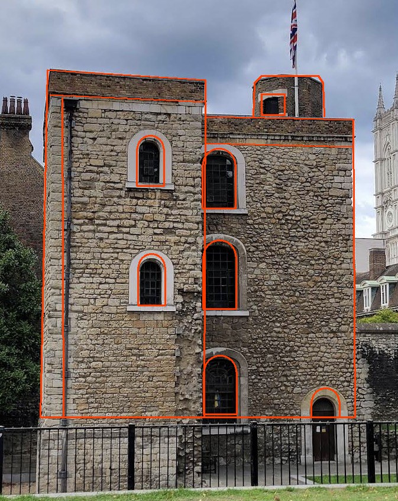
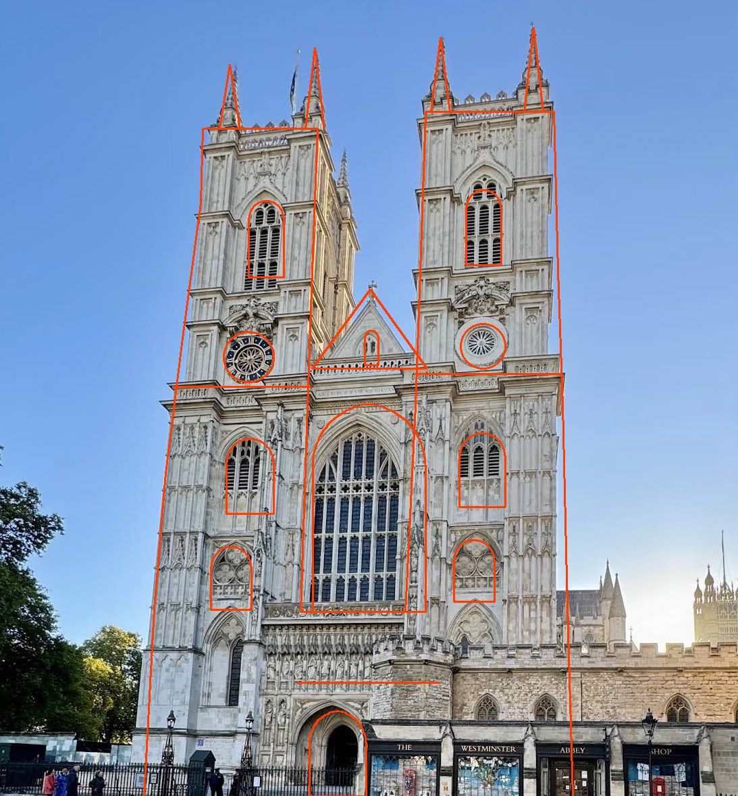
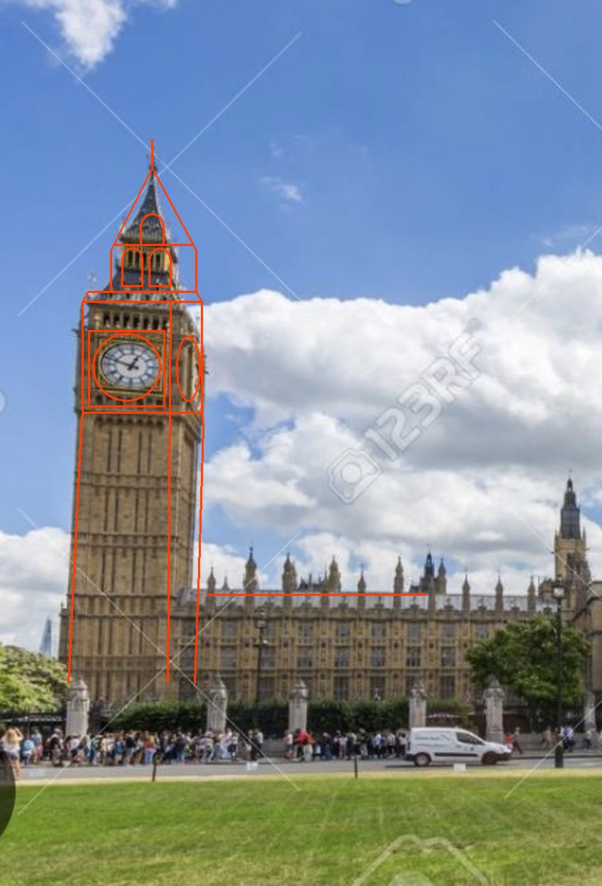

# The Architect Order

A real-world walking puzzle game, played on a phone alongside a paper diary the
team carries. One static page on GitHub Pages: no backend, no logins, no
accounts. A team is a phone, and progress lives in that phone's localStorage.

The page walks a team through a fixed sequence of stops. A stop shows text and
pictures; it may require the phone to be physically at a place before going on;
it may ask a question with a small number of guesses; and it may open the
camera with a picture laid over the live view that the player lines up against
something real.

## Layout

    content/<hunt>.md      real hunts, written as narrative
    content/fixture.json   the fixture hunt: fake stops that exercise every feature
    app/player.html        the player template, with one marker line for the hunt
    app/lens.js            the camera overlay
    app/img/               images referenced by content, by relative path
    pipeline/build.py      validate the content, bake it into the page
    pipeline/narrative.py  read a hunt written as Markdown
    site/                  build output, gitignored

## Build

    python3 pipeline/build.py content/architect-order.md site
    python3 pipeline/build.py content/fixture.json site/fixture

Python 3 standard library only, no npm, no bundler. A hunt is either Markdown
or JSON, by the name of the file, and the two produce the same page. It
validates the hunt and exits non-zero naming the stop, or the line, if
anything is wrong, then writes the output directory (`site` if none is given):
the page, `lens.js`, and only the images that hunt refers to. The second
directory can sit inside the first, so the real hunt is at the site root and
the fixture at `/fixture/`.

## Writing the narrative

`content/architect-order.md` is the hunt. All of its words live there, in
order, and moving a paragraph from one stop to another is moving the words.
Nothing else has to be touched, and the page is rebuilt from it two ways:

- **On GitHub.** Edit the file in the browser and commit to `main`. The
  workflow builds and publishes it, and fails the run without publishing if
  the file no longer reads.
- **Here.** `python3 pipeline/build.py content/architect-order.md site`, then
  serve `site` as above.

The whole format:

    # The Architect Order        the hunt's title
    id: architect-order          optional; the file's name if left out
    test_mode: yes               optional; see below
    diary: 148 x 210 mm          optional

    ## Intro                     the words before the walk

    ## Stop: first               one section per stop, walked in this order
    chapter: Location one        the header on the card
    title: A second line         optional
    reveal: Westminster, on the pass
    gate: 51.4984528, -0.1260286, 40 m, compass, distance
    lens: stencil img/jewel-tower-stencil.png, auto, match 0.35
    note: Line the drawing up with the building.
    marks: 0, 300, 600, 914      a cord lens only

    ### Body                     the words before the gate
    ### Question
    ask: What do they lay on the pendulum to keep it to time?
    answers: PENNIES, PENNY, OLD PENNIES, PENCE, COINS, COPPERS
    guesses: 3
    ### After                    the words once the stop is resolved

    ## Outro                     the ending, before the tally

Everything under `### Body`, `### After`, `## Intro` and `## Outro` is prose:

- A **blank line** starts a new paragraph, and each paragraph arrives on its
  own. A paragraph wrapped over several lines is still one paragraph.
- **`(same reveal)`** on a line of its own joins the paragraph after it to the
  one before, so the two arrive together as one.
- **`(pause 1 s)`** on a line of its own holds the next paragraph back. Also
  `(pause 400 ms)`. Between a tenth of a second and five seconds.
- A **picture** is an ordinary Markdown image line, alone, with its caption as
  the quoted title: ``.

The settings lines are `name: value`, and only the names above are understood;
anything else on those lines is an error rather than a paragraph that quietly
disappears. After the new chapter, a `reveal` takes `on the pass`, `at 300 m`
and `title <words>`; a `gate` takes `compass` and `distance` after the radius;
a `lens` takes `auto`, `match <n>`, `hold <n> ms`, `gated`, `not gated`,
`fallback <n> s` and `no fallback` after the picture. Commas separate those,
so a chapter or a stencil note that needs a comma of its own is fine, but an
answer is not.

JSON hunts still build, and `content/fixture.json` is still one, because it is
a test rig rather than something anybody reads.

## Test

    python3 -m http.server -d site 8000

Then open `http://localhost:8000` for the real hunt and
`http://localhost:8000/fixture/` for the fixture. Not `file://`: the camera
needs a secure context, and localhost counts as one while a file path does not.

Add `#testing` to the address for the position simulator. It is deliberately
off unless asked for by name, and it does not weaken the real gate rule.

The camera and the real gates can only be tested on a phone, at the Pages URL.

## Stencils and the match

A stencil lens can carry a match, at which point the lens scores how well the
edges in the camera frame line up with the stencil, several times a second,
and shows the score as a bar with a Progress button under it. The player still
lines the stencil up by hand; the code only checks the alignment.

    lens: stencil img/placeholder-stencil.png, auto, match 0.35, hold 600 ms, gated
    note: Line the outline up with the plaque.

`auto` means the lens is a step in the stop rather than a tool beside it,
but the camera always opens from a tap: iOS refuses it otherwise, and a fix
window or a timer is not a tap. So at the moment the lens would have opened,
a lit button opens it. After a gate that button is Continue, which opens the
lens directly; with no gate it is **Open the camera**, lit when the body
finishes revealing, a triple tap included. The same button reopens the lens
if it was closed before Progress.
The number after `match` is the score that counts as matched, `hold` how long
it must stay there, `gated` or `not gated` whether Progress waits for it, and
`fallback <n> s` how many seconds of trying light Progress anyway. Left out,
those are 0.35, 600 ms, gated, and no fallback. The Log button in the
lens appends one sample per press to a per-hunt log on the phone; **Copy log**
in the menu puts it on the clipboard as tab-separated text with a header row.

**Supplying a real stencil.** A PNG with a transparent background and dark
lines 2–4 px wide, at roughly 600–800 px on the long side, drawn from a
head-on photo of the target at the framing a phone gets from three to five
metres. Big distinctive edges only: the outline and two or three strong
internal lines. A stencil that traces every engraved letter fails in glare;
one that is only a rectangle matches anything. Drop it in `app/img/`, point
`src` at it, and the build checks it exists. `img/placeholder-stencil.png` is
a rectangle inside a rectangle, which roughly fits a doorway, a window or a
notice board, for testing on almost any wall before real stencils exist.

The match reads only the alpha channel, so the line colour is free: pick one
that shows over the real surface. This is what a made stencil looks like laid
over the photo it was drawn from, which is what an aligned match looks like
on the phone. The preview is documentation and is not shipped to the player.

## The tick

Every tap ticks. On iPhone, Safari ticks a native switch only when a finger
lands on it, so every button carries an invisible switch stretched over its
face; the finger lands on the switch, the phone ticks, and the tap carries on
to the button. That tick is one fixed light impact, Apple's, and a page cannot
make it heavier or double it. On Android the tick is a vibration: 50 ms for an
ordinary tap, and two pulses for the taps that carry the player forward,
which are Begin, Continue, Open the camera, Progress, Next, and a right
answer. Those buttons carry `data-strong`; that is the one place to tune.

## Test mode, the live distance, and a name that resolves

- **`test_mode: yes`** at the top of a hunt turns on every player-facing
  testing affordance: a plain Skip button on every location check, every
  match and every question; the threshold slider in the lens; and a Start
  over button in the bar at the top of the walk that is always on screen.
  Skipped parts count in the ending as skipped, not wrong. One line: make it
  `no` and rebuild before anybody plays for real, and none of them exist.
  Start over stays in the menu either way. `#testing` in the address is
  separate: that is the position simulator, a developer tool.
- **The threshold slider**, test mode only, runs from 0.05 to 0.95 and starts
  at the stop's match threshold. Moving it moves the tick on the bar and
  changes the pass test at once. The setting is kept per stop on the phone
  while test mode is on, and every Log line records the threshold in force.
- **`distance`** on a gate line shows the distance to the target from each
  usable fix while the gate card is open, rounded the way a person would say
  it. The compass rule is unchanged.
- **`reveal: Westminster, at 500 m, title …`** on a stop with a gate keeps the
  stop's written chapter and title until a usable fix reads within that
  distance, then changes them, once, for good. Passing the gate reveals it
  too. The distance defaults to 500 m, where the compass drops out; `on the
  pass` means only on the pass. On a stop with no gate, a reveal applies when
  Progress is pressed on the stop's match. At least one of the new chapter and
  the new title is required.
- A stop's **`title` is optional**; the card shows the chapter as its header
  and a title only if there is one. Nothing on a card or the opening counts
  the stops. A `gate.prompt` in an older JSON hunt is accepted and not shown.
- **`(pause 1 s)`** in any run of prose holds the next paragraph back by that
  long, between 100 and 5000 ms. It renders nothing.
- **Finishing a reveal** is three taps within a second and a half on the text
  that is arriving. One or two taps do nothing.

## Deploy

Pushing to `main` builds and publishes to GitHub Pages: the real hunt at the
root of the Pages URL and the fixture under `/fixture/`. Which hunts those are
is the pair of variables, `HUNT` and `FIXTURE`, at the top of
`.github/workflows/pages.yml`.
